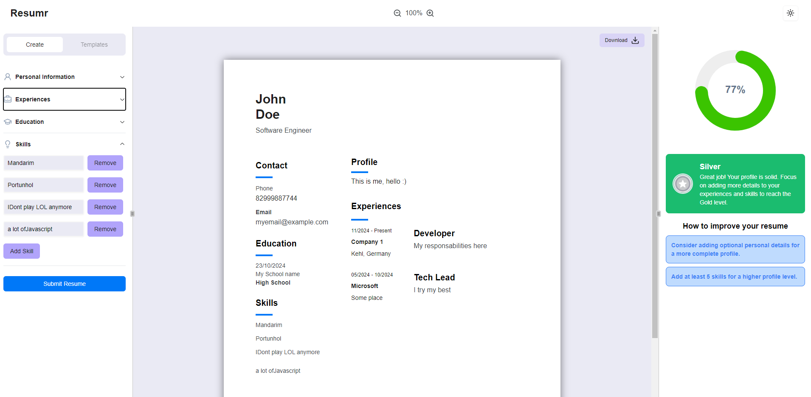

# Resumr

~~O Criador de Currículos Que Ninguém Pediu~~



## 🎭 Sobre Nós (Ou Seja, Eu)

Esse projeto foi criado sem propósito

## 🌟 "Coisas Que Funcionam" (ou deveriam)

- 📝 **Construtor de Currículos Customizável**: Porque todo mundo adora preencher formulários.
- 🌓 **Dark Mode**: Olha que fofo, nos preocupamos com sua visão 🥹
- 🎨 **Templates Modernos**: _Vou inserir, juro_. 🤞
- 🔄 **Pré-visualização em Tempo Real**
- 📄 **Exportar em PDF**

## 🛠️ Techs usadas

- Next.js
- TypeScript
- React Hook Form

## Como Usar

_Sério? Você quer usar isso? Muito obrigado :)_

1. Clone esse repo

```bash
git clone https://github.com/jm4rcos/resume-bulder.git
```

2. Instale as dependências

```bash
npm install
```

3. Rode o projeto (e reze)

```bash
npm run dev
```

4. Abra o navegador e acesse http://localhost:3000, caso o universo esteja ao seu favor. 🌍

## 🔏 Política de Privacidade

Como usamos seus dados?

- Não usamos 👍

## 🐛 Bugs

_Prefiro chamar de "Recursos Não Documentados"_

Mas não são bugs, são features que você ainda não entendeu.

## 📞 Suporte

Tem alguma dúvida? Eu também! Mas pode entrar em contato mesmo assim, vai que a gente descobre a resposta juntos.

## 🙏 Agradecimentos

- Café ☕
- Aquele tutorial indiano no YouTube sobre html to pdf 🎥
- E mais Café
